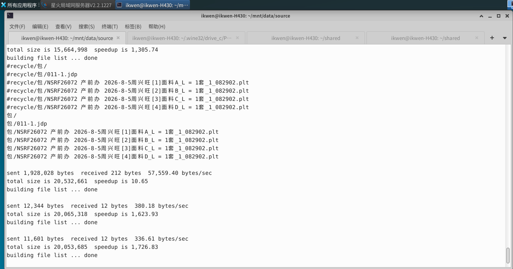

# rsync3.sh  自动备份共享目录

   运行后会自动监控目录： /home/ikwen/mnt/data/source
当此目录有文件“修改”，“删除”，“新增”后，都会自动备份到 /home/ikwen/mnt/data/backup/
，如果是删除文件，可以到：/home/ikwen/mnt/data/history 文件夹用：
find /home/ikwen/mnt/data/backup -type f -printf "%T@ %p\n" | sort -rn | cut -d' ' -f2- > /home/ikwen/shared/newest_files.txt

查找 。
找到后的内容会在这： /home/ikwen/shared/newest_files.txt

以后只要文件发生变动或被覆盖，被替换掉的旧文件都会自动备份到 history/时间戳/ 目录下。哪怕有人把花样改错了，你也能去历史文件夹里翻出修改前的“原版”，不会再出现无路可退的情况。

